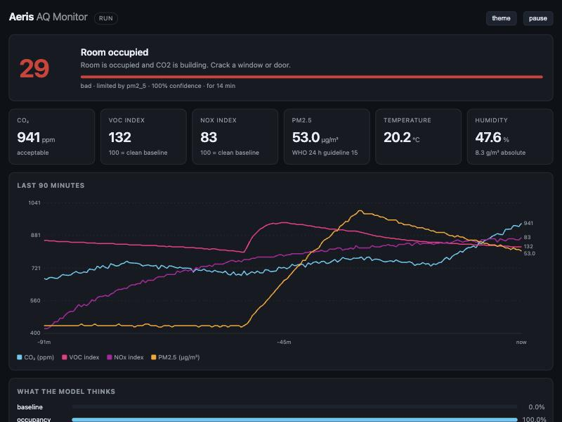

# Aeris AQ Monitor

[](https://github.com/slay-a/aeris-aq-monitor/actions/workflows/ci.yml)

An indoor air-quality monitor built on an ESP32-C3 that measures CO₂, VOC/NOx,
temperature, humidity and particulates over one I²C bus, and runs a quantized
neural network on-device to say **why** the air changed — cooking, someone in
the room, a window open, a solvent — rather than only showing four numbers.



> **Status: firmware complete, hardware not yet in hand.** Everything here is
> written, compiled warning-clean and tested against a simulator that models the
> sensors at the protocol level and the room at the physics level. The sensors
> are on order. [`docs/BRINGUP.md`](docs/BRINGUP.md) is the checklist for when
> they arrive, and the numbers it asks for are deliberately not guessed at here.

---

## What is interesting about it

**The drivers are written from the datasheets.** No vendor libraries. The SCD40
driver does its own command framing, its own CRC-8 validation on every 16-bit
word, and honours each command's execution delay — which matters because these
parts do not clock-stretch, so a read issued early gets a NACK rather than a
wait. [`docs/PROTOCOL.md`](docs/PROTOCOL.md) collects the details that are easy
to get wrong, each of which produced a bug at some point and now has a test.

**The same C runs on the device and on a host.** `core/` depends on nothing but
C11 and three headers, and allocates nothing. The firmware's I²C backend is the
ESP-IDF; the host's is a set of virtual sensors that decode the real opcodes,
answer with real CRC-8s and NACK reads that arrive too early. So the test suite
exercises the code that ships, not a model of it.

**The training data comes out of the firmware's own feature code.** `make
dataset` runs a room physics model through those virtual sensors and through the
real gas-index, windowing and feature pipeline. The CSV the trainer reads is
literally what the device computes, which removes train/serve skew at its
source rather than hoping it is small.

**The int8 kernel is proved identical to the trainer.** `ml/quant.py`
reimplements `core/src/model.c`'s integer arithmetic exactly, so the accuracy
reported during training is the accuracy of the network that ships. It then
emits 255 held-out samples with their int8 inputs and int32 logits, and
`tests/test_model.c` replays them through the C and requires a bit-exact match.

**Three FreeRTOS tasks, one snapshot.** The sampling task blocks for 15 ms on
the SHT31, 50 ms on the SGP41, 500 ms on an SCD40 stop. It blocks only itself.
The dashboard answers throughout.

---

## Results

All figures below are from the simulator — see
[the honest caveat](#about-those-numbers).

| | |
|---|---|
| Event classification, int8, held-out sessions | **98.25 %** (macro F1 0.978) |
| Same network in float32 | 98.28 % |
| Model size | **708 bytes** of parameters |
| Inference | 560 MACs; 0.13 µs on an M-series host *(on-target figure pending)* |
| Acceptance scenario | 99.0 % of settled samples correct |
| Test suite | 1192 checks |
| Fault injection | 354 of 354 injected bit-flips caught by CRC |
| Firmware binary | 846 kB, 45 % of the app partition free |

CI runs three jobs on every push: the host tests and simulation, a from-scratch
dataset regeneration and retrain (which must still clear an accuracy floor and
stay bit-exact against the C kernel), and an actual ESP-IDF v5.3 build for the
esp32c3 target. The firmware size above is from that build.

A Linux retrain lands at 98.23 % rather than the 98.25 % of the committed model.
The dataset is produced by C float code and `expf`/`logf` differ between libm
implementations, so the weights differ by a few LSB across platforms. CI
therefore checks the accuracy floor and the parity, not byte equality.

```
int8 confusion (rows = truth, cols = predicted)
                 baseline   occupancy     cooking ventilation    volatile
baseline            10219         155          22          20           0
occupancy             378       20435           0           1         156
cooking                 0           4        9198           0           0
ventilation             0           0           0        6889           0
volatile               23         115           0           0        2308
```

### About those numbers

**They are against a simulator, not a room.** A physics model does not contain
the smell of a particular kitchen, a radiator cycling, a cat, or an SGP41's own
ageing. The real-world figure will be lower, especially for `volatile` versus
`occupancy` — a mild solvent and a person both produce a modest VOC rise, and
only CO₂ distinguishes them.

Two things keep the number from being hollow:

- **The split is grouped by session**, not by row. Rows within a session are
  heavily autocorrelated — a 5-minute slope feature overlaps 60 consecutive
  samples — so a random split leaks the test set into training. The 15 test
  sessions were never seen.
- **The 2.5 minutes after every event change are discarded.** The room has not
  responded yet and those rows are genuinely unlabelable; training on them
  produces a model that scores well offline and fails in the room.

Collecting real labelled data is step 10 of the bring-up checklist, and both
numbers will be reported here once it exists.

---

## Try it without hardware

```bash
make test      # 1192 checks: protocol framing, CRC, features, model parity
make sim       # the acceptance scenario, with a confusion matrix
make faults    # NACKs and bit-flips injected; does corruption get through?
make serve     # the real dashboard at localhost:8080, 60x real time
```

`make serve` runs the firmware's actual sampling loop against virtual sensors
and serves the dashboard and JSON API from `core/src/api.c` — the same function
the ESP32 calls, so the bytes are identical. At 60× speed a cooking event plays
out in about twenty seconds.

To regenerate the model end to end:

```bash
make dataset   # ~186k labelled rows from 60 simulated sessions, <1 s
make model     # train, quantize, export model_params.h and parity vectors
```

Only numpy is required. There is no TensorFlow in this repository.

### Build the firmware

```bash
. $IDF_PATH/export.sh        # ESP-IDF v5.2+
cd firmware && idf.py set-target esp32c3 && idf.py menuconfig
idf.py build flash monitor
```

With no WiFi SSID configured it comes up as an open AP named `aeris-XXXX` with
the dashboard at `192.168.4.1` — which is what you want on a bench with no
router. With credentials it joins your network and advertises `aeris.local`.

---

## Hardware

| Part | Measures | Addr |
|------|----------|------|
| ESP32-C3-DevKitM-1 | — | — |
| Sensirion SCD40 | CO₂ (true NDIR) | `0x62` |
| Sensirion SGP41 | VOC / NOx | `0x59` |
| Sensirion SHT31 | Temperature, RH | `0x44` |
| Plantower PMSA003I | PM1.0 / 2.5 / 10 | `0x12` |

One bus, four wires. Wiring, pins to avoid on the C3, pull-ups, the power budget
and the self-heating problem are in [`docs/HARDWARE.md`](docs/HARDWARE.md).

---

## How it decides

Fourteen features over a six-minute window feed a 14→16→16→5 MLP.

The one worth calling out is **absolute humidity**. Relative humidity *rises*
when a window opens on a cold day, because the incoming air cools the room
faster than it dries it — so RH alone makes ventilation look like occupancy.
Absolute humidity, computed from temperature and RH via the Magnus formula,
falls instead, because cold air genuinely holds less water. Fusing two sensors
into one physical quantity is what separates those classes.

Raw argmax at 0.2 Hz flickers, so the output is smoothed with an EMA and gated
by hysteresis: a challenger must beat the state on screen by 0.12 and hold that
lead for 20 seconds. Confidence shown is the smoothed probability of the state
being *displayed*, not of the instantaneous argmax — otherwise the number
contradicts the label mid-transition.

Full detail, including the quantization scheme, in [`docs/ML.md`](docs/ML.md).

---

## Repository layout

```
core/        Portable C11. No IDF, no FreeRTOS, no allocation. Compiled for
             both the ESP32-C3 and the host.
firmware/    ESP-IDF app: I²C backend, HTTP server, WiFi/mDNS, LED task.
sim/         Room physics, virtual sensors at the protocol level, scenarios,
             and a host HTTP server that serves the real dashboard.
tests/       1192 checks, including bit-exact model parity with the trainer.
ml/          numpy training, int8 quantization, C export. No TensorFlow.
web/         The dashboard, ~13 kB, embedded in flash.
docs/        Hardware, protocol details, architecture, ML, bring-up checklist.
```

## API

| Path | Returns |
|------|---------|
| `/` | The dashboard |
| `/api/live` | Readings, event label, AQI, class probabilities |
| `/api/history` | 90 minutes at 30 s resolution |
| `/api/status` | Sensor presence, per-sensor error counters, model info |
| `/api/debug` | The raw feature vector, named |
| `/api/history.csv` | History as CSV, for collecting labelled data |

## Not done yet

- Everything in [`docs/BRINGUP.md`](docs/BRINGUP.md) — the hardware is on order.
- Training on real labelled data rather than simulated.
- Multi-room: battery nodes reporting to a hub over ESP-NOW. The core is already
  transport-agnostic, but none of it is written and none of it is claimed.

## Licence

MIT. See [LICENSE](LICENSE).
